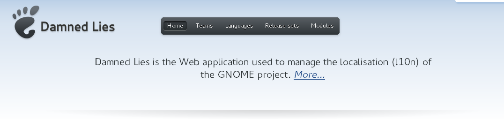
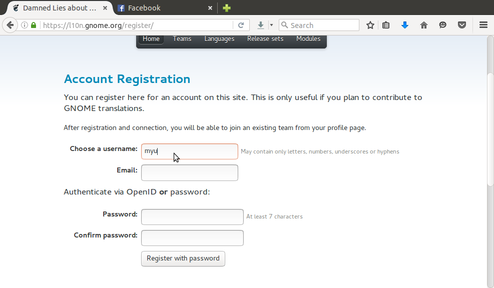
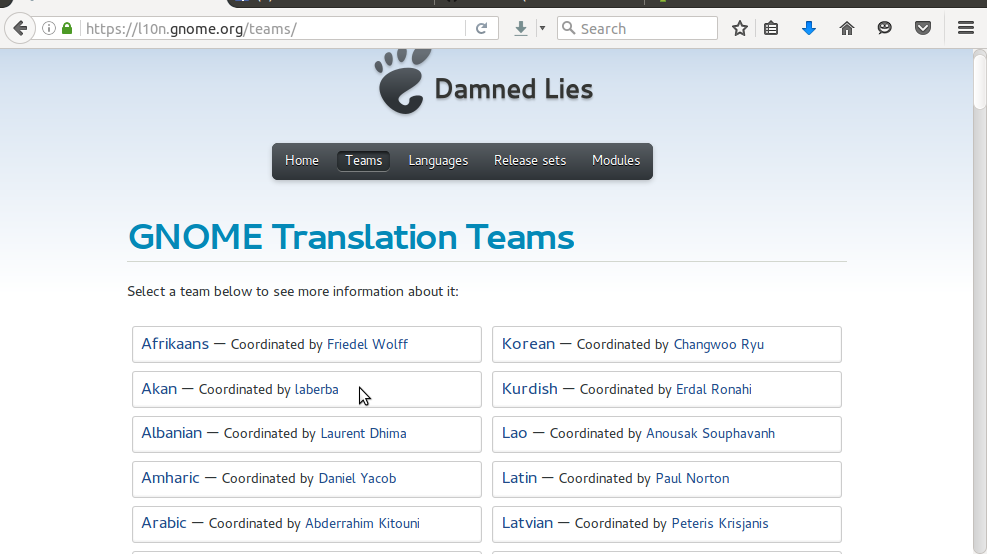
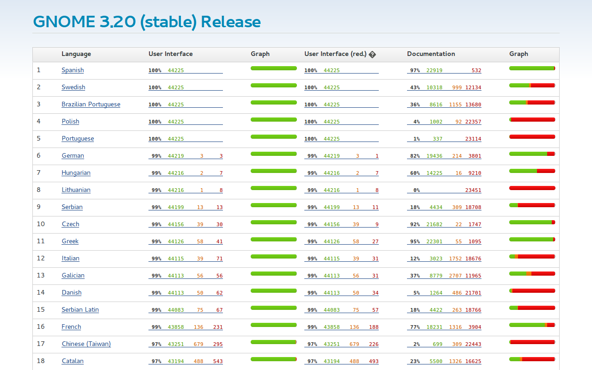
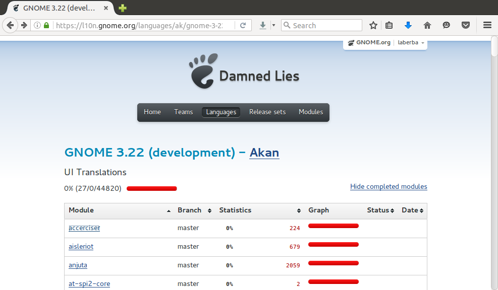
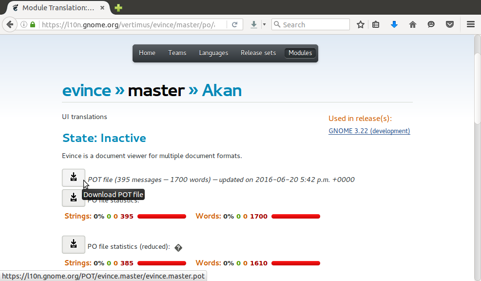

# Gnome Akan Translation Guide

Welcome to a translation guide from `Akan Translators`. This guide is meant to guide you to learn how you can help translate the `Gnome Software Stack` to twi.

- **Akan Translators** is a team of people who help translate softwares, books, documentations, and other information to the Akan language, mostly `Libre`. For more information, contact us at:

  - Mailing List:
  - Launchpad: <https://launchpad.net/~akan-translators>
  - Facebook: <https://www.facebook.com/akantranslators/>
  - Google+: <https://plus.google.com/u/1/communities/101188536005568178400>
  - Social Media Hash-tag: #akantranslators on Twitter, Facebook, Google+

- **Gnome Software Stack** in this context refers to the softwares and other technologies developed by the [Gnome Project](gnome.org) and other hard-working people. These softwares stack are used to develop some Linux OS distributions and other applications, mostly as [Free Software](fsf.org).

# Content Outline

1. Introduction to the Translation Process

    1. How translation work
    2. Creating and account at `Deam Lies` (Gnome Translation Website)
    3. Learning about the translation website and project releases
    4. Translation tools and resources
    5. Setting up your computer for translation

2. Beginning Translation

    1. Choosing a project to contribute
    2. Getting .pot and .po files
    3. Translation process
    4. Submitting translate .po files

# CHAPTER ONE: Introduction to the Translation Process

## How translation work

The translations process is very simple and straight forward. First software developers develop the various software stacks and place the translation strings (terms, phrases, sentences, etc.) originally used in development available at [Deamed Lies](https://l10n.gnome.org) (a website created for translators). Translations strings are usually American English Language and have the a `.po` or `.pot`. Translation string with `.po` extension are those that have been partially translated and those with `.pot` used to start afresh. Translators will there have to visit their [language team section](https://l10n.gnome.org/teams) and select their language of choice where they can either the `.po` or `.pot` files onto their computer and translate into their local language. Translators must have to download the `.po` instead of the `.pot` file when the software has been partly translated to continue or improve upon the translations. _This is done to avoid duplicate work_. After translating, they then visit Deamed Lies again to upload the translated version for it to be bundled with the software during release.

> Translating from American English to your local language is a voluntary effort and no individual is paid by the project to do translations.

To be able to translate to your local language, that language must first be registered among the available language where someone is assigned the responsibility of coordinating the team. If a local language is not available and someone wants to translate into that language, he/she must contact the administrators at <https://page.com> to enquire how he/she can get that language added.

In out context, the `Akan Translators Team` is already registered and is available at <https://l10n.gnome.org/teams/ak/>. However, only individuals who have a [Deamed Lies](https://l10n.gnome.org) account are legible to access translation strings. Creating an account is free of charge.

## Creating and account at `Deam Lies`

Visit Deamed Lies at <https://l10n.gnome.org> and click on the `Log in` link at the top-right conner of the page.

> If you have already created an account fill-in your `Username` and `Password` and click on the `Log in` link below the password entry to sign into your existing account.

To create an account, click on `Register` and you will be sent to the account registration page where you can create a new account.

At the `Account Registration` page, fill-in the form and click on `Register with password` to submit the form. After doing this, a message containing a link will be sent to the email address you used to register. Check you inbox and click on that link to confirm the creation of your account. After this, you should now receive a confirmation message in your email inbox again to inform you that you account has now been created successfully.

## Learning about the translation website and project releases

Deamed Lies has four (3) important section which are worth mentioning. They include the `Translation Teams Section`, the `Project Releases Section`, `All Translation Progress Section`, `Individual Language Translation Progress Section`, and `Translation String Download Section`.

### [Translation Teams Section]() [FIX LINK]

This page displays the list of available team along their respective `Team Coordinator`. The coordinator is responsible for managing the team.

### [Project Releases Section]() [FIX LINK]

This page displays the various versions of the Gnome Software Stack. These include the previous and current versions, `(stable)`, as well as, the uncompleted version which is under development and yet to be released in the near future, `(development)`. It is recommended to translate the `(development)` version which will come with the latest features and changes made in previous releases. Those still under development are provided so that translators can complete translations before final release.

### [All Translation Progress Section]() [FIX LINK]

This page displays translations progress of each language in terms of the percentage completely translated. Translations for each language is divided into three section which include `User Interface`, `User Interface (red)` and `Documentation`. Under each section, the percentage translated is indicated in green colour and the percentage untranslated is indicated in red colour. Under each language sections that have completely been translated are fully green whilst those that have not been translated are fully red. You can now scroll scroll down to `Akan` to see translation progress.

### [Individual Language Translation Progress Section]() [FIX LINK]

This page displays the translation progress of an individual language. On this page you can see translation progress on each component that form part of the whole software stack. Each translator decide on the component he or she wants to translate so those that have more green are those that have received major attention from translators. However, the team can agree and prioritise components which they are willing to collectively translate first.

[Translation String Download Section]() [FIX LINK]  Clicking on any component in the `Individual Language Translation Progress Section` will take you to this page where you can download translation string and upload translated string of that particular component. Below is the function of the various buttons at the top section of the page;

- Clicking the first button labelled as `POT file` will download a template translation string (translation strings that are used to start afresh) for the component.
- Clicking the second button labelled as `PO file statistics`
- Clicking the second button labelled as `PO file statistics (reduced)`

--------------------------------------------------------------------------------

## Translation tools and resources

Tools you may need for translation include;

- A computer (Linux, Windows, MacOS, BSD, etc.).
- A software for translating string. There are several softwares available for translating .po files but we recommend [Poedit](https://poedit.net) which is available for Linux, Windows, MacOS, etc. and free to use.
- Copy of the `Akan Translation Guide` from https//github.com/laberba/akan-translation-guide

## Setting up your computer for translation

A creating an account as explained in [Creating and account at Deam Lies]() [FIX LINK], you can go ahead and [download Poedit](https://poedit.net/download) and install onto you computer.

# CHAPTER TWO: Beginning Translation

In this section you will learn how you can download translation strings (.po or.pot files) for the Akan language, translate using Poedit, and then upload it after translation.

## Choosing a project to contribute

After installation, you can now visit the Akan Team page at <https://l10n.gnome.org/teams/ak/>. It is recommended to translate for the version labelled `(development)` which is will be the newest to be release in the near future. Since new version releases usually come with new features and improvements, translating for older version will leave new changes untranslated. The version labelled `(development)` will likely be the first on top the list.

## Getting .pot and .po files

## Translation process

tr

## Submitting translate .po files
